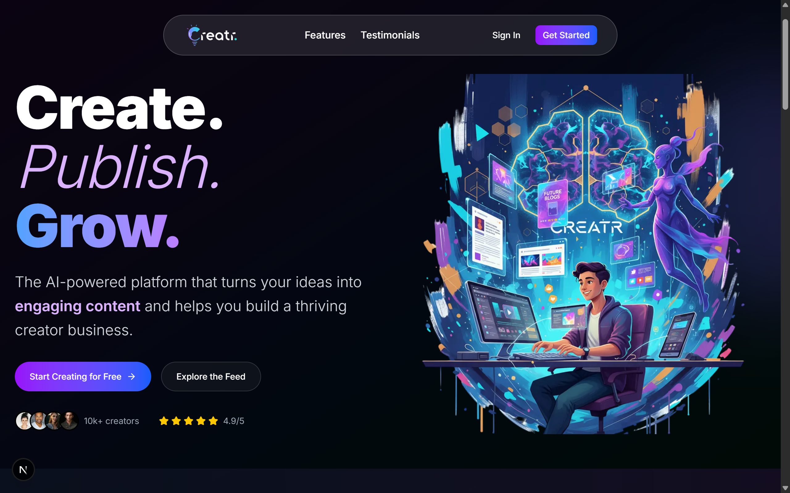

# Creatr - AI-Powered Content Creation Platform

## 🚀 Preview 

<div align="center">
  
  <p><em>Dashboard Overview</em></p>
</div>

## 🚀 Overview

**Creatr** is a modern, full-stack content creation platform that leverages AI to help creators generate, publish, and manage engaging blog content. Built with cutting-edge technologies, it provides a comprehensive solution for content creators, bloggers, and digital marketers to streamline their content workflow and grow their audience.

### ✨ Key Features

- 🤖 **AI-Powered Content Generation** - Google Gemini AI integration for automated blog writing
- 📝 **Rich Text Editor** - React Quill-based editor with advanced formatting options
- 🖼️ **Smart Media Management** - ImageKit integration for optimized image handling
- 👥 **Social Features** - Likes, comments, follows, and community engagement
- 📊 **Analytics Dashboard** - Real-time performance tracking and insights
- 🔐 **Secure Authentication** - Clerk-based user management and security
- 📅 **Content Scheduling** - Plan and schedule posts for optimal engagement
- 🎨 **Modern UI/UX** - Beautiful, responsive design with Shadcn UI components

## 🛠️ Tech Stack

### Frontend
- **Next.js 15.4.6** - React framework with App Router
- **React 19.1.0** - Latest React with concurrent features
- **TypeScript** - Type-safe development
- **Tailwind CSS 4.0** - Utility-first CSS framework
- **Shadcn UI** - Modern component library
- **React Quill** - Rich text editor
- **Lucide React** - Beautiful icons

### Backend & Database
- **Convex** - Real-time backend-as-a-service
- **Clerk** - Authentication and user management
- **Google Gemini AI** - AI content generation
- **ImageKit** - Image optimization and CDN

### Development Tools
- **ESLint** - Code linting and formatting
- **PostCSS** - CSS processing
- **Turbopack** - Fast development builds


## 🚀 Getting Started

### Prerequisites

- Node.js 18+ 
- npm or yarn
- Convex account
- Clerk account
- Google Gemini API key
- ImageKit account

### Installation

1. **Clone the repository**
   ```bash
   git clone https://github.com/yourusername/creatr.git
   cd creatr
   ```

2. **Install dependencies**
   ```bash
   npm install
   # or
   yarn install
   ```

3. **Set up environment variables**
   Create a `.env.local` file in the root directory:
   ```env
   # Convex Configuration
   CONVEX_DEPLOYMENT=your_convex_deployment
   NEXT_PUBLIC_CONVEX_URL=your_convex_url

   # Clerk Authentication
   NEXT_PUBLIC_CLERK_PUBLISHABLE_KEY=your_clerk_publishable_key
   CLERK_SECRET_KEY=your_clerk_secret_key
   NEXT_PUBLIC_CLERK_SIGN_IN_URL=/sign-in
   NEXT_PUBLIC_CLERK_SIGN_UP_URL=/sign-up
   CLERK_JWT_ISSUER_DOMAIN=your_clerk_domain

   # ImageKit Configuration
   NEXT_PUBLIC_IMAGEKIT_PUBLIC_KEY=your_imagekit_public_key
   NEXT_PUBLIC_IMAGEKIT_URL_ENDPOINT=your_imagekit_url
   IMAGEKIT_PRIVATE_KEY=your_imagekit_private_key

   # External APIs
   NEXT_PUBLIC_UNSPLASH_ACCESS_KEY=your_unsplash_key
   GEMINI_API_KEY=your_gemini_api_key
   ```

4. **Set up Convex**
   ```bash
   npx convex dev
   ```

5. **Run the development server**
   ```bash
   npm run dev
   # or
   yarn dev
   ```

6. **Open your browser**
   Navigate to [http://localhost:3000](http://localhost:3000)

## 📁 Project Structure

```
creatr/
├── app/                    # Next.js App Router
│   ├── (auth)/            # Authentication routes
│   ├── (public)/          # Public pages
│   ├── dashboard/         # User dashboard
│   ├── api/              # API routes
│   └── actions/          # Server actions
├── components/            # React components
│   ├── ui/               # Shadcn UI components
│   └── ...               # Custom components
├── convex/               # Convex backend
│   ├── schema.js         # Database schema
│   └── ...               # Backend functions
├── hooks/                # Custom React hooks
├── lib/                  # Utility functions
└── public/               # Static assets
```

## 🎯 Features in Detail

### AI Content Generation
- Generate blog posts from titles using Google Gemini AI
- Content improvement and optimization suggestions
- SEO-friendly content recommendations
- Image prompt generation for featured images

### Content Management
- Rich text editor with formatting options
- Draft and published post management
- Content scheduling and publishing
- Tag and category organization

### Social Features
- User profiles and public pages
- Follow/unfollow system
- Like and comment functionality
- Content discovery feed

### Analytics & Insights
- Real-time view tracking
- Daily analytics dashboard
- Performance metrics
- Engagement statistics

## 🔧 Configuration

### Convex Setup
1. Create a new Convex project
2. Run `npx convex dev` to sync your schema
3. Update your environment variables

### Clerk Authentication
1. Create a Clerk application
2. Configure authentication providers
3. Set up user management settings

### ImageKit Integration
1. Create an ImageKit account
2. Configure upload settings
3. Set up transformation presets

## 🚀 Deployment

### Vercel (Recommended)
1. Push your code to GitHub
2. Connect your repository to Vercel
3. Configure environment variables
4. Deploy automatically

### Other Platforms
The application can be deployed to any platform that supports Next.js:
- Netlify
- Railway
- DigitalOcean App Platform
- AWS Amplify

## 🤝 Contributing

We welcome contributions! Please follow these steps:

1. Fork the repository
2. Create a feature branch (`git checkout -b feature/amazing-feature`)
3. Commit your changes (`git commit -m 'Add amazing feature'`)
4. Push to the branch (`git push origin feature/amazing-feature`)
5. Open a Pull Request

## 📝 License

This project is licensed under the MIT License - see the [LICENSE](LICENSE) file for details.

## 🙏 Acknowledgments

- [Next.js](https://nextjs.org/) - The React framework
- [Convex](https://convex.dev/) - Real-time backend
- [Clerk](https://clerk.com/) - Authentication
- [Shadcn UI](https://ui.shadcn.com/) - Component library
- [Google Gemini](https://ai.google.dev/) - AI capabilities

## 📞 Support

If you have any questions or need help, please:
- Open an issue on GitHub
- Check the documentation
- Join our community discussions

---

<div align="center">
  <p>Made with ❤️ by <strong>G.Eesaan</strong></p>
  <p>
    <a href="https://github.com/yourusername/creatr">⭐ Star this repo</a> •
    <a href="https://github.com/yourusername/creatr/issues">🐛 Report Bug</a> •
    <a href="https://github.com/yourusername/creatr/pulls">💡 Request Feature</a>
  </p>
</div>
